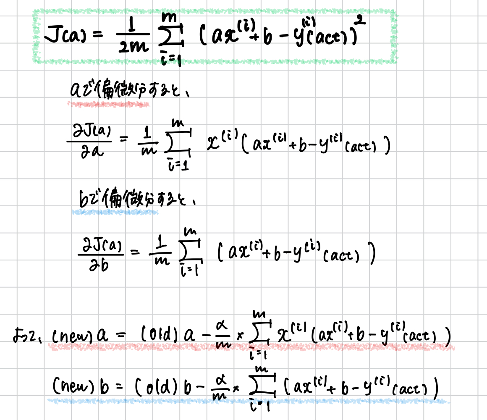
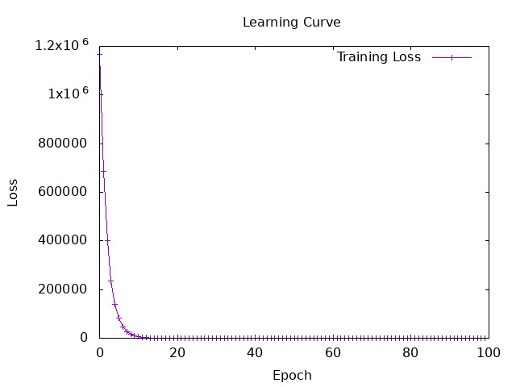

# Hands On Tasks

How to execute the LinearRegression projects:
```
(if necessary)
$ docker-compose up -d

- for task3 - 
$ docker-compose exec hasktorch /bin/bash -c "cd /home/ubuntu/Hasktorch && stack run session3-linear-regression"

- for task4 - 
 $ docker-compose exec hasktorch /bin/bash -c "cd /home/ubuntu/Hasktorch && stack run session3-multiple-regression"

- for task5 -
$ docker-compose exec hasktorch /bin/bash -c "cd /home/ubuntu/Hasktorch && stack run session3-graduate-admission-linear"
```

### 3.b: results of initial linear function
correct answer: 130.0  
estimated: 176.72504  
******* 
correct answer: 195.0  
estimated: 197.81503  
*******
correct answer: 218.0  
estimated: 249.43002
*******
correct answer: 166.0  
estimated: 193.93002  
*******
correct answer: 163.0  
estimated: 214.46503
*******
correct answer: 155.0  
estimated: 165.07004
*******
correct answer: 204.0  
estimated: 178.94504
*******
correct answer: 270.0  
estimated: 203.36502
*******
correct answer: 205.0  
estimated: 164.51503
*******
correct answer: 127.0  
estimated: 137.87503
*******
correct answer: 260.0  
estimated: 211.69003
*******
correct answer: 249.0  
estimated: 238.33002
*******
correct answer: 251.0  
estimated: 236.11005
*******
correct answer: 158.0  
estimated: 158.41003
*******
correct answer: 167.0  
estimated: 190.60004
*******

```
import Torch.Tensor (Tensor, asTensor, asValue)
import Torch.Functional (matmul, mul, add, transpose2D)


ys :: Tensor
ys = asTensor ([130, 195, 218, 166, 163, 155, 204, 270, 205, 127, 260, 249, 251, 158, 167] :: [Float])
xs :: Tensor
xs = asTensor ([148, 186, 279, 179, 216, 127, 152, 196, 126, 78, 211, 259, 255, 115, 173] :: [Float])

linear :: 
    (Tensor, Tensor) -> -- ^ parameters ([a, b]: 1 × 2, c: scalar)
    Tensor ->           -- ^ data x: 1 × 10
    Tensor              -- ^ z: 1 × 10
linear (slope, intercept) input = add (mul input slope) intercept

main :: IO ()
main = do
  let sampleA = asTensor ([0.555] :: [Float])
  let sampleB = asTensor ([94.585026] :: [Float])

  let estimatedY = linear (sampleA, sampleB) xs

  let ysList = asValue ys :: [Float]  -- convert Tensor to [Float]
  let estimatedYList = asValue estimatedY :: [Float]  -- convert Tensor to [Float]

  -- output
  mapM_ (\(y, e) -> 
    putStrLn $ "correct answer: " ++ 
    show y ++ "\nestimated: " ++ 
    show e ++ "\n*******")
    (zip ysList estimatedYList)
```


### 3.d: define a cost function
```
cost is: 1117.397
```

```
cost ::
    Tensor -> -- ^ grand truth: 1 × 10
    Tensor -> -- ^ estimated values: 1 × 10
    Tensor    -- ^ loss: scalar
cost z z' = 
    let diffs = sub z z'
        squarediffs = mul diffs diffs
        squarediffsList = asValue squarediffs :: [Float]
        answer = (sum squarediffsList) / fromIntegral (length squarediffsList)
        answerT = asTensor answer
  in answerT
```
**TODO: Implement this function without using Lists (if possible)**

### 3.e 〜 3.f inplement the function for renewing coefficients and training

```
calculateNewA ::
     Tensor ->
     Tensor ->
     Tensor
calculateNewA  estY oldA =
    let diff  = estY - ys
        diff2 = (sumAll $ (mul xs diff)) / 15
  in oldA - diff2 * 2e-5

calculateNewB ::
     Tensor ->
     Tensor ->
     Tensor
calculateNewB estY oldB =
    let diff = estY - ys
        total = sumAll diff / 15
  in oldB - total * 2e-5
```



I changed the number of arguments of each function...  

**TODO: Improve functions so that learning rates are obtained from arguments rather than directly entered**

### 3.g My model

🌟results🌟  
**α = 2.0e-5**
```
Epoch 0: Loss = 711041.6
A: 1.8251736B: 99.983894
******************
Epoch 1: Loss = 60856.387
A: 0.9042269B: 99.97922
******************
Epoch 2: Loss = 6146.4614
A: 0.6370808B: 99.97785
******************
Epoch 3: Loss = 1542.8881
A: 0.55958766B: 99.97745
******************
Epoch 4: Loss = 1155.5195
A: 0.53710866B: 99.977325
******************
Epoch 5: Loss = 1122.9244
A: 0.53058803B: 99.97728
******************
Epoch 6: Loss = 1120.1818
A: 0.5286966B: 99.977264
******************
Epoch 7: Loss = 1119.9508
A: 0.52814794B: 99.97725
******************
Epoch 8: Loss = 1119.9315
A: 0.52798885B: 99.97724
******************
Epoch 9: Loss = 1119.9298
A: 0.5279427B: 99.977234
******************
---------------------------------------
Epoch: 10
Final cost: 1119.9298
Final coefficient A: [0.5279427]
Final coefficient B: [99.977234]
---------------------------------------
```

- **α (learning rate)**  
I set this to **2.0e-5** because if α is larger than 1.0e-4, it becomes NaN.

- **Epoch**  
The value hardly changed after more than 10 repeated trials.
(Is the epoch quite dependent on the learning rate?)

- **initial value**
The results are considerably influenced by the initial values.
(Initial values need to be set appropriately???)


--- 
### 4. Implement multiple linear regression
```
Epoch 0: Loss = 39637.0
Epoch 10: Loss = 120.33748
Epoch 20: Loss = 117.239075
Epoch 30: Loss = 115.96401
Epoch 40: Loss = 115.43909
Epoch 50: Loss = 115.22306
Epoch 60: Loss = 115.1342
Epoch 70: Loss = 115.09749
Epoch 80: Loss = 115.0824
Epoch 90: Loss = 115.07623
Epoch 100: Loss = 115.07363
Epoch 110: Loss = 115.072716
Epoch 120: Loss = 115.07219
Epoch 130: Loss = 115.072105
Epoch 140: Loss = 115.072044
---------------------------------------
Epoch: 150
Learning rate: Tensor Float []  2.0000e-5
Initial coefficient A1: [0.0]
Initial coefficient A2: [0.0]
Initial coefficient B: [0.0]
---------------------------------------
Final cost: 115.07192
Final coefficient A1: [0.6057865]
Final coefficient A2: [0.44173887]
Final coefficient B: [2.7905963e-3]
---------------------------------------
```

### 5.e Write a code to load data files
https://qiita.com/TTsurutani/items/811814ebf548332ede8a
https://hackage.haskell.org/package/cassava-0.5.3.0/docs/Data-Csv.html


### 5.f My training results
```
Epoch 0: Loss = 1165944.8
A: 7.666525 B: -2.1562912e-2
******************
Epoch 1: Loss = 684971.9
A: 5.877977 B: -3.8090333e-2
******************
Epoch 2: Loss = 402408.72
A: 4.5071015 B: -5.0758187e-2
******************
Epoch 3: Loss = 236407.9
A: 3.4563615 B: -6.046778e-2
******************
Epoch 4: Loss = 138885.4
A: 2.650997 B: -6.790995e-2
******************
Epoch 5: Loss = 81592.74
A: 2.0337062 B: -7.361419e-2
******************
・
・
・
******************
Epoch 95: Loss = 1.1848298e-2
A: 7.649397e-3 B: -9.234251e-2
******************
Epoch 96: Loss = 1.1848298e-2
A: 7.6493975e-3 B: -9.234258e-2
******************
Epoch 97: Loss = 1.1848296e-2
A: 7.649398e-3 B: -9.2342645e-2
******************
Epoch 98: Loss = 1.1848294e-2
A: 7.649399e-3 B: -9.234271e-2
******************
Epoch 99: Loss = 1.1848293e-2
A: 7.6494e-3 B: -9.234278e-2
******************
---------------------------------------
Epoch: 100
Final cost: 1.1848293e-2
Final coefficient A: [7.6494e-3]
Final coefficient B: [-9.234278e-2]
---------------------------------------
```

### 5.g check the model behavior
```
correct answer: 0.75
estimated: 0.7184936
*******
correct answer: 0.73
estimated: 0.7031948
*******
correct answer: 0.72
estimated: 0.726143
*******
correct answer: 0.62
estimated: 0.687896
*******
correct answer: 0.67
estimated: 0.7031948
*******
correct answer: 0.81
estimated: 0.79498756
*******
correct answer: 0.63
estimated: 0.67259717
*******
correct answer: 0.69
estimated: 0.6802466
*******
correct answer: 0.8
estimated: 0.76439
*******
correct answer: 0.43
estimated: 0.6419996
*******
correct answer: 0.8
estimated: 0.7720394
*******
correct answer: 0.73
estimated: 0.71084416
*******
correct answer: 0.75
estimated: 0.7184936
*******
correct answer: 0.71
estimated: 0.73379236
*******
correct answer: 0.73
estimated: 0.726143
*******
correct answer: 0.83
estimated: 0.75674057
*******
correct answer: 0.72
estimated: 0.7490912
*******
correct answer: 0.94
estimated: 0.8102864
*******
correct answer: 0.81
estimated: 0.73379236
*******
correct answer: 0.81
estimated: 0.726143
*******
correct answer: 0.75
estimated: 0.726143
*******
correct answer: 0.79
estimated: 0.7490912
*******
correct answer: 0.58
estimated: 0.7184936
*******
correct answer: 0.59
estimated: 0.6955454
*******
correct answer: 0.47
estimated: 0.6419996
*******
correct answer: 0.49
estimated: 0.6572984
*******
correct answer: 0.47
estimated: 0.64964896
*******
correct answer: 0.42
estimated: 0.62670076
*******
correct answer: 0.57
estimated: 0.6649478
*******
correct answer: 0.62
estimated: 0.6802466
*******
correct answer: 0.74
estimated: 0.726143
*******
correct answer: 0.73
estimated: 0.7490912
*******
correct answer: 0.64
estimated: 0.67259717
*******
correct answer: 0.63
estimated: 0.687896
*******
correct answer: 0.59
estimated: 0.6572984
*******
correct answer: 0.73
estimated: 0.7184936
*******
correct answer: 0.79
estimated: 0.7414418
*******
correct answer: 0.68
estimated: 0.7031948
*******
correct answer: 0.7
estimated: 0.71084416
*******
correct answer: 0.81
estimated: 0.726143
*******
```

### 5.i Draw a learning curve 
https://github.com/DaisukeBekki/nlp-tools/blob/master/src/ML/Exp/Chart.hs#L18
```
type LearningChart = (Name,[Loss]) --Name of an experiment and list of loss values

drawLearningCurve ::
  FilePath           -- ^ The filepath for the PNG file
  -> String          -- ^ The caption of the PNG file
  -> [LearningChart] -- ^ The list of data
  -> IO()
```


### 6. Predict chance of Admit in a different way
→ used Sigmoid function (Logistic Regression)
→ still trying improving...
→ need more than two explanatory variables ???

```
******************
Epoch 1: Loss = 6.6065215e-2
A: 9.864577e-4 B: 8.903482e-6
******************
Epoch 2: Loss = 6.0519718e-2
A: 1.4369776e-3 B: 1.2960561e-5
******************
Epoch 3: Loss = 5.5615228e-2
A: 1.8613107e-3 B: 1.677565e-5
******************
Epoch 4: Loss = 5.1280845e-2
A: 2.2610696e-3 B: 2.0363648e-5
******************
Epoch 5: Loss = 4.7451764e-2
A: 2.6377814e-3 B: 2.373866e-5
******************
Epoch 6: Loss = 4.406961e-2
A: 2.9928864e-3 B: 2.6913987e-5
******************
Epoch 7: Loss = 4.1082058e-2
A: 3.3277383e-3 B: 2.9902138e-5
・
・
・
・
******************
Epoch 293: Loss = 1.7448392e-2
A: 9.454793e-3 B: 5.562616e-5
******************
Epoch 294: Loss = 1.7448392e-2
A: 9.454794e-3 B: 5.551794e-5
******************
Epoch 295: Loss = 1.7448392e-2
A: 9.454795e-3 B: 5.540972e-5
******************
Epoch 296: Loss = 1.744839e-2
A: 9.454796e-3 B: 5.53015e-5
******************
Epoch 297: Loss = 1.744839e-2
A: 9.454798e-3 B: 5.5193283e-5
******************
Epoch 298: Loss = 1.7448388e-2
A: 9.454799e-3 B: 5.5085064e-5
******************
Epoch 299: Loss = 1.7448388e-2
A: 9.4548e-3 B: 5.4976845e-5
******************
---------------------------------------
Epoch: 300
Final cost: 1.7448388e-2
Final coefficient A: [9.4548e-3]
Final coefficient B: [5.4976845e-5]
---------------------------------------
correct answer: 0.75
estimated: 0.7315034
*******
correct answer: 0.73
estimated: 0.72777325
*******
correct answer: 0.72
estimated: 0.73335636
*******
correct answer: 0.62
estimated: 0.7240108
*******
correct answer: 0.67
estimated: 0.72777325
*******
correct answer: 0.81
estimated: 0.7496622
*******
correct answer: 0.63
estimated: 0.72021633
*******
correct answer: 0.69
estimated: 0.7221175
*******
correct answer: 0.8
estimated: 0.7424979
*******
correct answer: 0.43
estimated: 0.7125325
*******
correct answer: 0.8
estimated: 0.74430156
*******
correct answer: 0.73
estimated: 0.7296424
*******
correct answer: 0.75
estimated: 0.7315034
*******
correct answer: 0.71
estimated: 0.7352011
*******
correct answer: 0.73
estimated: 0.73335636
*******
correct answer: 0.83
estimated: 0.7406861
*******
correct answer: 0.72
estimated: 0.738866
*******
correct answer: 0.94
estimated: 0.7531942
*******
correct answer: 0.81
estimated: 0.7352011
*******
correct answer: 0.81
estimated: 0.73335636
*******
correct answer: 0.75
estimated: 0.73335636
*******
correct answer: 0.79
estimated: 0.738866
*******
correct answer: 0.58
estimated: 0.7315034
*******
correct answer: 0.59
estimated: 0.72589606
*******
correct answer: 0.47
estimated: 0.7125325
*******
correct answer: 0.49
estimated: 0.71639013
*******
correct answer: 0.47
estimated: 0.71446526
*******
correct answer: 0.42
estimated: 0.70864373
*******
correct answer: 0.57
estimated: 0.71830714
*******
correct answer: 0.62
estimated: 0.7221175
*******
correct answer: 0.74
estimated: 0.73335636
*******
correct answer: 0.73
estimated: 0.738866
*******
correct answer: 0.64
estimated: 0.72021633
*******
correct answer: 0.63
estimated: 0.7240108
*******
correct answer: 0.59
estimated: 0.71639013
*******
correct answer: 0.73
estimated: 0.7315034
*******
correct answer: 0.79
estimated: 0.73703766
*******
correct answer: 0.68
estimated: 0.72777325
*******
correct answer: 0.7
estimated: 0.7296424
*******
correct answer: 0.81
estimated: 0.73335636
*******
```