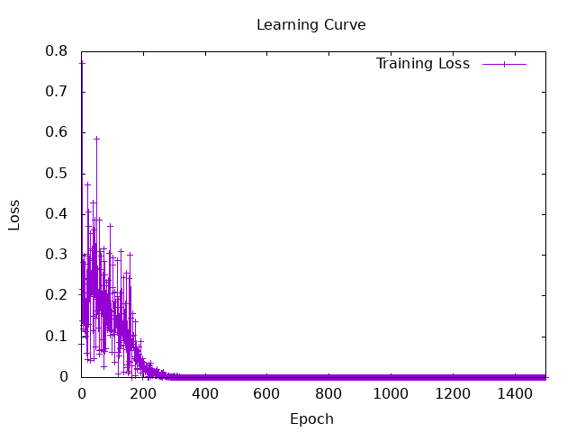
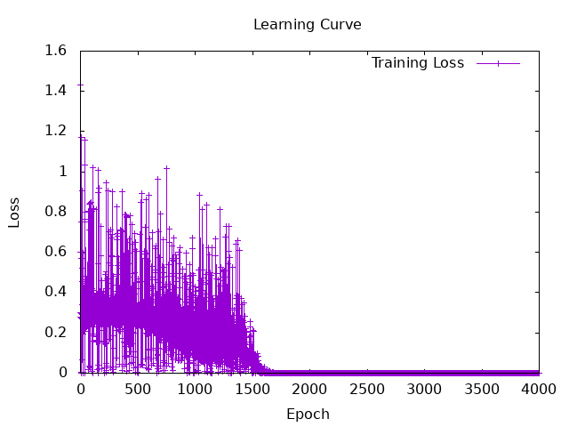
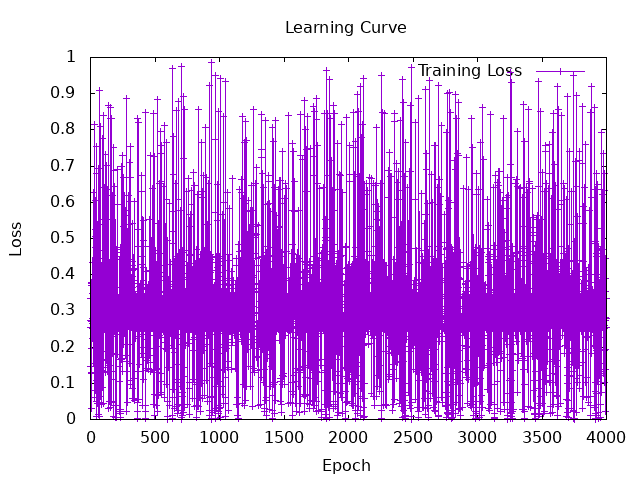

# Session4
```
docker-compose exec hasktorch /bin/bash -c "cd /home/ubuntu/Hasktorch && stack run session4-perceptron-andgate"
```

## 4.1 Build and train an AND gate using a simple perceptron

Learning rate: 0.1
```
----- Training perceptron of AND gate -----
Initial weights: [2.092598,2.6983223], bias: 2.9987245
Epoch 1 total err: 3.0
Epoch 2 total err: 3.0
Epoch 3 total err: 3.0
Epoch 4 total err: 3.0
Epoch 5 total err: 3.0
Epoch 6 total err: 3.0
Epoch 7 total err: 3.0
Epoch 8 total err: 3.0
Epoch 9 total err: 3.0
Epoch 10 total err: 3.0
Epoch 11 total err: 2.0
Epoch 12 total err: 2.0
Epoch 13 total err: 2.0
Epoch 14 total err: 2.0
Epoch 15 total err: 1.0
Epoch 16 total err: 1.0
Epoch 17 total err: 1.0
Epoch 18 total err: 0.0
Final weights: [0.6925976,0.9983226], bias: -1.1012751
----- Training complete. below are the results -----
Input: [1.0,1.0] Predicted: 1.0 True: 1.0
Input: [1.0,0.0] Predicted: 0.0 True: 0.0
Input: [0.0,1.0] Predicted: 0.0 True: 0.0
Input: [0.0,0.0] Predicted: 0.0 True: 0.0
```

## 4.2 understaing the implementation of Multi-Layer Perceptron in hasktorch

### 1. definition of MLP
```
data MLPSpec = MLPSpec
  { feature_counts :: [Int],
    nonlinearitySpec :: Tensor -> Tensor
  }
```
→ Defines the MLP architecture:  
- feature_counts: A list specifying **the number of units** in each layer.

- nonlinearitySpec: Specifies **the non-linear activation function.**  
  ex) Torch.tanh


```
data MLP = MLP
  { layers :: [Linear],
    nonlinearity :: Tensor -> Tensor
  }
  deriving (Generic, Parameterized)

```
→ Represents the MLP model:

- layers: A list of linear layers.

- nonlinearity: The activation function from MLPSpec


### 2. implement the MLP
```
mlp :: MLP -> Tensor -> Tensor
mlp MLP {..} input = foldl' revApply input $ intersperse nonlinearity $ map linear layers
```


### 3. implement XOR function
```
tensorXOR :: Tensor -> Tensor
tensorXOR t = (1 - (1 - a) * (1 - b)) * (1 - (a * b))
  where
    a = select 1 0 t
    b = select 1 1 t
```


### 4. training process
① initialize the model
```
init <- sample $ MLPSpec { feature_counts = [2, 2, 1], 
```
input layer: two dimentions  
hidden layer: two dimentions  
output lyaer: one dimention

```
nonlinearitySpec = Torch.tanh } 
```
specify the activation function (tanh)

② training roop
```
trained <- foldLoop init numIters $ \state i -> do
  input <- randIO' [batchSize, 2] >>= return . (toDType Float) . (gt 0.5)
  let (y, y') = (tensorXOR input, squeezeAll $ model state input)
      loss = mseLoss y y'
  when (i `mod` 100 == 0) $ do
    putStrLn $ "Iteration: " ++ show i ++ " | Loss: " ++ show loss
  (newState, _) <- runStep state optimizer loss 1e-1
  return newState
```
---
a. generate a training data
```
input <- randIO' [batchSize, 2] >>= return . (toDType Float) . (gt 0.5)
```
if the value is greater than 0.5, then set it to 1. Otherwise, 0 and convert to Float  

---

b. compare the predicted value to actual value
```
let (y, y') = (tensorXOR input, squeezeAll $ model state input)
    loss = mseLoss y y'
```
y: actual value → calculated by tensorXOR (function)  
y': predicted value → calculated by model state input

```
tensorXOR :: Tensor -> Tensor
    tensorXOR t = (1 - (1 - a) * (1 - b)) * (1 - (a * b))
      where
        a = select 1 0 t
        b = select 1 1 t
```
---
c. renew the model
```
(newState, _) <- runStep state optimizer loss 1e-1
return newState
・
・
・
optimizer = GD
```
Learning rate: 0.1    
This training uses gardient descent method.  
passes the new model parameter to next iteration.

### d. Experiment with XOR using other activate function
**tanh**
```
MLPSpec
        { feature_counts = [2, 2, 1],
          nonlinearitySpec = Torch.tanh
        }
```
```
Iteration: 100 | Loss: 0.11495585
Iteration: 200 | Loss: 2.1468617e-2
Iteration: 300 | Loss: 4.054754e-3
Iteration: 400 | Loss: 8.850193e-6
Iteration: 500 | Loss: 1.11246145e-7
Iteration: 600 | Loss: 1.8371352e-8
Iteration: 700 | Loss: 1.3015011e-10
Iteration: 800 | Loss: 3.968381e-12
Iteration: 900 | Loss: 4.3343107e-13
Iteration: 1000 | Loss: 6.039613e-14
Iteration: 1100 | Loss: 5.684342e-14
Iteration: 1200 | Loss: 3.1974423e-14
Iteration: 1300 | Loss: 4.440892e-14
Iteration: 1400 | Loss: 7.1054274e-15
Iteration: 1500 | Loss: 2.3092639e-14
---------------------------------------
***************************************
number of iterations: 1500
learning rate: Tensor Float []  0.1000   
Final Model:
0, 0 => Tensor Float []  0.0000
0, 1 => Tensor Float []  1.0000   
1, 0 => Tensor Float []  1.0000   
1, 1 => Tensor Float []  1.1921e-7
---------------------------------------
```

---
**sigmoid**  
hasktorch/hasktorch/src/Torch/Functional.hs
https://github.com/hasktorch/hasktorch/blob/ea1363ffae0da0e529b4b41f830e008b68be1ef5/hasktorch/src/Torch/Functional.hs#L552
```
-- | Applies the element-wise function sigmoid.
sigmoid ::
  -- | input
  Tensor ->
  -- | output
  Tensor
sigmoid t = unsafePerformIO $ cast1 ATen.sigmoid_t t
```

```
MLPSpec
        { feature_counts = [2, 2, 1],
          nonlinearitySpec = Torch.sigmoid
        }
```
```
Iteration: 100 | Loss: 0.2424367
Iteration: 200 | Loss: 0.37395212
Iteration: 300 | Loss: 0.24289018
Iteration: 400 | Loss: 0.13428399
Iteration: 500 | Loss: 4.537295e-3
Iteration: 600 | Loss: 0.43186772
Iteration: 700 | Loss: 0.41496944
Iteration: 800 | Loss: 0.4931919
Iteration: 900 | Loss: 0.12597598
Iteration: 1000 | Loss: 0.3328783
Iteration: 1100 | Loss: 0.4435013
Iteration: 1200 | Loss: 5.828099e-3
Iteration: 1300 | Loss: 0.22318369
Iteration: 1400 | Loss: 5.5824127e-2
Iteration: 1500 | Loss: 3.47829e-2
Iteration: 1600 | Loss: 7.645512e-3
Iteration: 1700 | Loss: 1.7373008e-4
Iteration: 1800 | Loss: 1.0719359e-4
Iteration: 1900 | Loss: 1.6820613e-5
Iteration: 2000 | Loss: 3.2075667e-7
Iteration: 2100 | Loss: 1.7199328e-8
Iteration: 2200 | Loss: 1.9544188e-10
Iteration: 2300 | Loss: 4.4089177e-11
Iteration: 2400 | Loss: 1.030287e-12
Iteration: 2500 | Loss: 4.440892e-14
Iteration: 2600 | Loss: 1.7763568e-14
Iteration: 2700 | Loss: 1.4210855e-14
Iteration: 2800 | Loss: 3.5527137e-15
Iteration: 2900 | Loss: 0.0
Iteration: 3000 | Loss: 1.7763568e-15
Iteration: 3100 | Loss: 7.1054274e-15
Iteration: 3200 | Loss: 3.5527137e-15
Iteration: 3300 | Loss: 3.5527137e-15
Iteration: 3400 | Loss: 1.7763568e-15
Iteration: 3500 | Loss: 1.7763568e-15
Iteration: 3600 | Loss: 1.7763568e-14
Iteration: 3700 | Loss: 1.4210855e-14
Iteration: 3800 | Loss: 3.1974423e-14
Iteration: 3900 | Loss: 3.5527137e-15
Iteration: 4000 | Loss: 3.5527137e-15
---------------------------------------
number of iterations: 4000
learning rate: Tensor Float []  0.3000   
Final Model:
0, 0 => Tensor Float []  1.1921e-7
0, 1 => Tensor Float []  1.0000   
1, 0 => Tensor Float []  1.0000   
1, 1 => Tensor Float []  5.9605e-8
---------------------------------------
```


**step**
```
Iteration: 100 | Loss: 0.83946204
Iteration: 200 | Loss: 0.25562945
Iteration: 300 | Loss: 0.32309133
Iteration: 400 | Loss: 0.6741559
Iteration: 500 | Loss: 1.1129061e-2
Iteration: 600 | Loss: 1.9957258e-4
Iteration: 700 | Loss: 0.25917304
Iteration: 800 | Loss: 0.38532323
Iteration: 900 | Loss: 0.20703241
Iteration: 1000 | Loss: 0.18342744
Iteration: 1100 | Loss: 0.28019175
Iteration: 1200 | Loss: 0.27835625
Iteration: 1300 | Loss: 3.997835e-2
Iteration: 1400 | Loss: 0.3933398
Iteration: 1500 | Loss: 0.25942636
Iteration: 1600 | Loss: 0.10435981
Iteration: 1700 | Loss: 0.43551612
Iteration: 1800 | Loss: 0.25128657
Iteration: 1900 | Loss: 0.41814107
Iteration: 2000 | Loss: 0.38373768
Iteration: 2100 | Loss: 0.53264666
Iteration: 2200 | Loss: 0.25409752
Iteration: 2300 | Loss: 0.2782286
Iteration: 2400 | Loss: 0.25440088
Iteration: 2500 | Loss: 0.3517782
Iteration: 2600 | Loss: 0.28955755
Iteration: 2700 | Loss: 4.7762837e-2
Iteration: 2800 | Loss: 0.286104
Iteration: 2900 | Loss: 0.33724588
Iteration: 3000 | Loss: 0.27213186
Iteration: 3100 | Loss: 0.2649412
Iteration: 3200 | Loss: 0.33658373
Iteration: 3300 | Loss: 0.4581278
Iteration: 3400 | Loss: 0.26408195
Iteration: 3500 | Loss: 0.5538566
Iteration: 3600 | Loss: 0.36390108
Iteration: 3700 | Loss: 0.14256164
Iteration: 3800 | Loss: 0.2515951
Iteration: 3900 | Loss: 0.34467548
Iteration: 4000 | Loss: 0.33335775
---------------------------------------
number of iterations: 4000
learning rate: Tensor Float []  0.1000   
Final Model:
0, 0 => Tensor Float []  0.6155   
0, 1 => Tensor Float []  0.6155   
1, 0 => Tensor Float []  0.6155   
1, 1 => Tensor Float []  0.6155   
---------------------------------------
```
