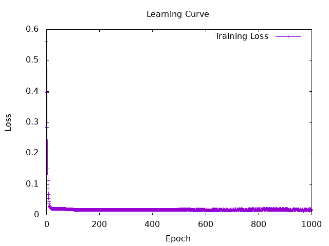
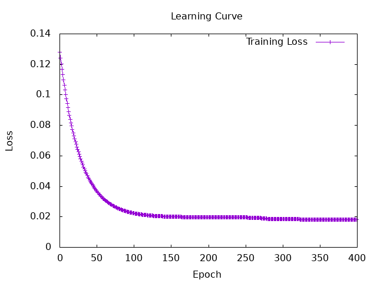

# Session5
```
docker-compose exec hasktorch /bin/bash -c "cd /home/ubuntu/Hasktorch && stack run session5-admission"
```

## results of admit.hs
### ① fininshed Building model and implementing evaluation  

```haskell
Iteration: 100 | Loss: 0.57774615
Iteration: 200 | Loss: 0.34356028
Iteration: 300 | Loss: 0.20681198
Iteration: 400 | Loss: 0.12736735
Iteration: 500 | Loss: 8.14383e-2
Iteration: 600 | Loss: 5.4999232e-2
Iteration: 700 | Loss: 3.9834276e-2
Iteration: 800 | Loss: 3.1161372e-2
Iteration: 900 | Loss: 2.6212836e-2
Iteration: 1000 | Loss: 2.339447e-2

True Positives: 20.0
True Negatives: 0.0
False Positives: 20.0
False Negatives: 0.0

Predictions: [[0.668993],[0.66907954],[0.6688896],[0.66874707],[0.66882074],[0.6706444],[0.6687267],[0.66872394],[0.66911626],[0.668723],[0.66924596],[0.6687355],[0.6687292],[0.6687647],[0.66872895],[0.66880524],[0.6687602],[0.66906905],[0.6687445],[0.66874284],[0.66872525],[0.66874874],[0.668723],[0.6687224],[0.66872215],[0.66872275],[0.6687222],[0.66872215],[0.66872215],[0.6687224],[0.66872287],[0.6687248],[0.66872215],[0.66872215],[0.66872215],[0.6687224],[0.6687231],[0.66872215],[0.6687222],[0.66872245]]
```
needs to be improved.... :(   
→ The value of predictions looks strange. 
They all appear to converge to the same value.  


memo: 
```haskell 
batchSize = 2  
numIters = 1000  
learningRate = 1e-3  


initModel <- sample $ MLPSpec
    { feature_counts = [7, 4, 2, 1],
      nonlinearitySpec = Torch.sigmoid
    }
```
### ② Try using deeper structure  
changed the **initModel**:

```haskell
Iteration: 100 | Loss: 4.777316e-2
Iteration: 200 | Loss: 2.2701789e-2
Iteration: 300 | Loss: 1.996466e-2
Iteration: 400 | Loss: 1.9661916e-2
Iteration: 500 | Loss: 1.962273e-2
Iteration: 600 | Loss: 1.9611137e-2
Iteration: 700 | Loss: 1.9601246e-2
Iteration: 800 | Loss: 1.9590044e-2
Iteration: 900 | Loss: 1.9577485e-2
Iteration: 1000 | Loss: 1.9564575e-2

True Positives: 20.0
True Negatives: 0.0
False Positives: 20.0
False Negatives: 0.0

Predictions: [[0.73375726],[0.73344946],[0.73405766],[0.73442876],[0.734144],[0.733521],[0.735383],[0.73549664],[0.73388577],[0.73565185],[0.7337775],[0.7344847],[0.73481727],[0.7342429],[0.7349076],[0.73414826],[0.7342639],[0.7339337],[0.734488],[0.7345637],[0.73521936],[0.73427594],[0.73556995],[0.7356576],[0.7356755],[0.73562765],[0.7356809],[0.73567986],[0.73567927],[0.7356744],[0.7355683],[0.73523915],[0.7356781],[0.7356684],[0.7356672],[0.73565316],[0.7355014],[0.73566675],[0.7356763],[0.73564756]]
```
memos: 
```haskell
initModel <- sample $ MLPSpec
    { feature_counts = [7, 64, 32, 16, 1],
      nonlinearitySpec = Torch.sigmoid
    }
```
**Deeper structure** made **convergence faster**, but did not solve the problem :(  

### ③ Try changing the activate function
used tanh instead of using sigmoid

```haskell
Iteration: 100 | Loss: 2.353147e-2
Iteration: 200 | Loss: 1.641017e-2
Iteration: 300 | Loss: 1.5728414e-2
Iteration: 400 | Loss: 1.5589273e-2
Iteration: 500 | Loss: 1.5482239e-2
Iteration: 600 | Loss: 1.537849e-2
Iteration: 700 | Loss: 1.527628e-2
Iteration: 800 | Loss: 1.5175437e-2
Iteration: 900 | Loss: 1.5075919e-2
Iteration: 1000 | Loss: 1.497774e-2

True Positives: 20.0
True Negatives: 0.0
False Positives: 20.0
False Negatives: 0.0

Predictions: [[0.54611754],[0.54606634],[0.5461296],[0.54613453],[0.5461305],[0.5444742],[0.54799426],[0.55484796],[0.5461137],[0.56132764],[0.5461002],[0.5461426],[0.5461975],[0.5461306],[0.5461449],[0.5461303],[0.546131],[0.5460937],[0.5461309],[0.546131],[0.54647994],[0.54613066],[0.5536328],[0.5544934],[0.5644683],[0.5585991],[0.55455554],[0.57017356],[0.5568749],[0.5563339],[0.54965824],[0.5461992],[0.55653197],[0.5639078],[0.573489],[0.5560953],[0.54675984],[0.56471664],[0.55368185],[0.5608654]]
```
:(  

## 3. Evaluate the model
```haskell
Training MLP...
Iteration: 100 | Loss: 1.7421247e-2
Iteration: 200 | Loss: 1.6665816e-2
Iteration: 300 | Loss: 1.5962373e-2
Iteration: 400 | Loss: 1.709782e-2
Iteration: 500 | Loss: 1.7406145e-2
Iteration: 600 | Loss: 1.5737157e-2
Iteration: 700 | Loss: 1.7479222e-2
Iteration: 800 | Loss: 1.9528935e-2
Iteration: 900 | Loss: 1.946023e-2
Iteration: 1000 | Loss: 1.52691705e-2

targets: [[0.75],[0.73],[0.72],[0.62],[0.67],[0.81],[0.63],[0.69],[0.8],[0.43],[0.8],[0.73],[0.75],[0.71],[0.73],[0.83],[0.72],[0.94],[0.81],[0.81],[0.75],[0.79],[0.58],[0.59],[0.47],[0.49],[0.47],[0.42],[0.57],[0.62],[0.74],[0.73],[0.64],[0.63],[0.59],[0.73],[0.79],[0.68],[0.7],[0.81]]
Predictions: [[0.6880692],[0.6692692],[0.6899043],[0.676265],[0.67328686],[0.6939432],[0.6747906],[0.68850416],[0.6938023],[0.6636185],[0.6934636],[0.6858462],[0.6928869],[0.68938446],[0.69380873],[0.69339085],[0.6919],[0.69400054],[0.68823],[0.6788001],[0.69206494],[0.6895035],[0.6920501],[0.68565434],[0.6634903],[0.64681727],[0.65424347],[0.649175],[0.6696791],[0.6612929],[0.687129],[0.6910414],[0.67836845],[0.68985534],[0.67378545],[0.6780188],[0.6851664],[0.69367045],[0.6772264],[0.67287755]]
Predicted Labels: [[1.0],[0.0],[1.0],[1.0],[0.0],[1.0],[0.0],[1.0],[1.0],[0.0],[1.0],[1.0],[1.0],[1.0],[1.0],[1.0],[1.0],[1.0],[1.0],[1.0],[1.0],[1.0],[1.0],[1.0],[0.0],[0.0],[0.0],[0.0],[0.0],[0.0],[1.0],[1.0],[1.0],[1.0],[0.0],[1.0],[1.0],[1.0],[1.0],[0.0]]
True Labels: [[1.0],[1.0],[1.0],[0.0],[0.0],[1.0],[0.0],[1.0],[1.0],[0.0],[1.0],[1.0],[1.0],[1.0],[1.0],[1.0],[1.0],[1.0],[1.0],[1.0],[1.0],[1.0],[0.0],[0.0],[0.0],[0.0],[0.0],[0.0],[0.0],[0.0],[1.0],[1.0],[0.0],[0.0],[0.0],[1.0],[1.0],[1.0],[1.0],[1.0]]

Pair 1:
  True Positive: 23.0
  True Negative: 10.0
  False Positive: 5.0
  False Negative: 2.0
  Accuracy: 0.825
  Precision: 0.8214286
  Recall: 0.92
  F1 Score: 0.8679245

Pair 2:
  True Positive: 10.0
  True Negative: 23.0
  False Positive: 2.0
  False Negative: 5.0
  Accuracy: 0.825
  Precision: 0.8333333
  Recall: 0.6666667
  F1 Score: 0.7407408

Overall Evaluation Results:
Macro F1 Score: 0.8043326
Weighted F1 Score: 0.8202306
Micro F1 Score: 0.825
```


```haskell
Training MLP...
Iteration: 100 | Loss: 2.2427987e-2
Iteration: 200 | Loss: 1.9719213e-2
Iteration: 300 | Loss: 1.8493798e-2
Iteration: 400 | Loss: 1.8210685e-2
Training completed.

Reading evaluation CSV file...
Evaluating model...
targets: [[0.75],[0.73],[0.72],[0.62],[0.67],[0.81],[0.63],[0.69],[0.8],[0.43],[0.8],[0.73],[0.75],[0.71],[0.73],[0.83],[0.72],[0.94],[0.81],[0.81],[0.75],[0.79],[0.58],[0.59],[0.47],[0.49],[0.47],[0.42],[0.57],[0.62],[0.74],[0.73],[0.64],[0.63],[0.59],[0.73],[0.79],[0.68],[0.7],[0.81]]
Predictions: [[0.6751595],[0.67744255],[0.67189217],[0.67012763],[0.67467576],[0.6696686],[0.671517],[0.6694491],[0.67433655],[0.672145],[0.6703994],[0.66881824],[0.6708885],[0.6720747],[0.6767654],[0.6763059],[0.671038],[0.6771107],[0.6778613],[0.6778201],[0.6706307],[0.67301255],[0.67284846],[0.6721253],[0.6708565],[0.6715927],[0.67172426],[0.66883206],[0.66948766],[0.6760625],[0.6727618],[0.67560714],[0.6727416],[0.6742937],[0.67348564],[0.6713615],[0.67471963],[0.6707672],[0.6703587],[0.668575]]
Predicted Labels: [[1.0],[1.0],[0.0],[0.0],[0.0],[0.0],[0.0],[0.0],[0.0],[0.0],[0.0],[0.0],[0.0],[0.0],[1.0],[1.0],[0.0],[1.0],[1.0],[1.0],[0.0],[0.0],[0.0],[0.0],[0.0],[0.0],[0.0],[0.0],[0.0],[1.0],[0.0],[1.0],[0.0],[0.0],[0.0],[0.0],[0.0],[0.0],[0.0],[0.0]]
True Labels: [[1.0],[1.0],[1.0],[0.0],[0.0],[1.0],[0.0],[1.0],[1.0],[0.0],[1.0],[1.0],[1.0],[1.0],[1.0],[1.0],[1.0],[1.0],[1.0],[1.0],[1.0],[1.0],[0.0],[0.0],[0.0],[0.0],[0.0],[0.0],[0.0],[0.0],[1.0],[1.0],[0.0],[0.0],[0.0],[1.0],[1.0],[1.0],[1.0],[1.0]]


Pair 1:
  True Positive: 8.0
  True Negative: 14.0
  False Positive: 1.0
  False Negative: 17.0
  Accuracy: 0.55
  Precision: 0.8888889
  Recall: 0.32
  F1 Score: 0.47058824

Pair 2:
  True Positive: 14.0
  True Negative: 8.0
  False Positive: 17.0
  False Negative: 1.0
  Accuracy: 0.55
  Precision: 0.4516129
  Recall: 0.93333334
  F1 Score: 0.6086956

Overall Evaluation Results:
Macro F1 Score: 0.5396419
Weighted F1 Score: 0.5223785
Micro F1 Score: 0.55
```

## 4.a loss functions

### negative log entropy
https://docs.pytorch.org/docs/stable/generated/torch.nn.functional.nll_loss.html#torch.nn.functional.nll_loss

Entropy is a measure of uncertainty (disorder).  
The entropy  H(P)  of a probability distribution  P  is defined as:

$$
H(P) = - \sum_{i} P(x_i) \log P(x_i)
$$

Negative log entropy is simply the negative of this value:

$$
- H(P) = \sum_{i} P(x_i) \log P(x_i)
$$

**Usage in Machine Learning:**  
→ Negative log entropy can be used for maximizing information content (ensuring effective learning).

### cross entropy
https://en.wikipedia.org/wiki/Cross-entropy

https://docs.pytorch.org/docs/stable/generated/torch.nn.functional.cross_entropy.html#torch.nn.functional.cross_entropy

Cross entropy measures the similarity between a "true distribution P" and a "predicted distribution Q ":

$$
H(P, Q) = - \sum_{i} P(x_i) \log Q(x_i)
$$

- P is the true probability distribution (ground truth).
- Q is the predicted probability distribution from a model.


**Usage in Machine Learning:**    
- **Classification Problems:** Used as a loss function in neural networks (especially softmax + cross-entropy).
- **Model Evaluation:** Evaluates how well a model's predictions match the true distribution.

### KL divergence
https://en.wikipedia.org/wiki/Kullback%E2%80%93Leibler_divergence

https://docs.pytorch.org/docs/stable/generated/torch.nn.functional.kl_div.html#torch.nn.functional.kl_div

KL Divergence measures how much one distribution P diverges from another distribution Q:

$$
D_{KL}(P \parallel Q) = \sum_{i} P(x_i) \log \frac{P(x_i)}{Q(x_i)}
$$

- P is the true (reference) distribution.
- Q is the approximated (predicted) distribution.

**Usage in Machine Learning:**    
Used in VAE (Variational Autoencoders) to minimize the difference between latent distributions.

### Relationship Between the Three
- **Negative Log Entropy** measures the "self-information" of a distribution.
- **Cross Entropy** measures how different a predicted distribution is from the true distribution.
- **KL Divergence** is the difference between cross entropy and entropy:

$$
D_{KL}(P \parallel Q) = H(P, Q) - H(P)
$$

This means KL Divergence quantifies the "distance" between the true distribution and the predicted distribution.

https://qiita.com/dennkitoiryou11/items/9f1451d90393e036e973

## 4.b Try using these three loss functions

### negative log entropy

### cross entropy
used  **binaryCrossEntropyLoss'** function
```haskell
trainMLP_crossEntropy :: MLP -> Tensor -> Tensor -> IO MLP
trainMLP_crossEntropy initModel inputs targets = do
  (trainedModel, lossValues) <- foldLoop (initModel, []) numIters $ \(state, losses) i -> do
    let yPred = sigmoid (mlp state inputs)
        loss = binaryCrossEntropyLoss' yPred targets
        lossValue = asValue loss :: Float
    when (i `mod` 300 == 0) $ do
      putStrLn $ "Iteration: " ++ show i ++ " | Loss: " ++ show lossValue
    (newState, _) <- runStep state optimizer loss learningRate
    return (newState, losses ++ [lossValue])
  
  drawLearningCurve "Session5/charts/MLP_Admission_LearningCurve_CrossEntropy.png" "Learning Curve (Binary Cross Entropy)" [("Training Loss", lossValues)]
  return trainedModel
  where
    optimizer = GD


```

### KL divergence
