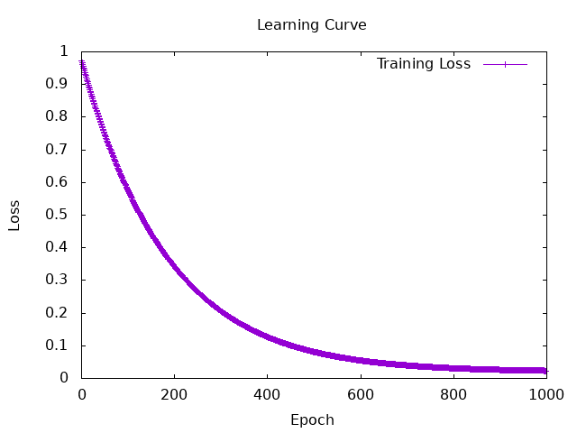
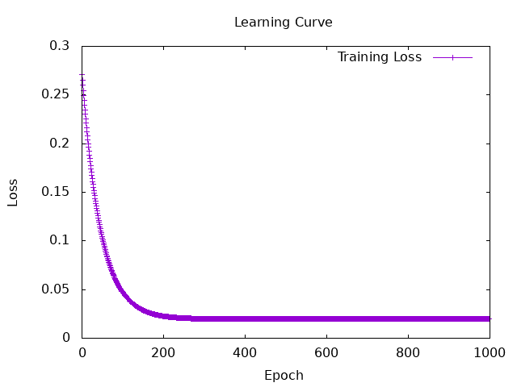
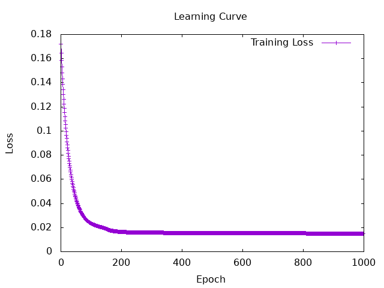

# Session5
```
docker-compose exec hasktorch /bin/bash -c "cd /home/ubuntu/Hasktorch && stack run session5-admission"
```

## results of admit.hs
### ① fininshed Building model and implementing evaluation  

```haskell
Iteration: 100 | Loss: 0.57774615
Iteration: 200 | Loss: 0.34356028
Iteration: 300 | Loss: 0.20681198
Iteration: 400 | Loss: 0.12736735
Iteration: 500 | Loss: 8.14383e-2
Iteration: 600 | Loss: 5.4999232e-2
Iteration: 700 | Loss: 3.9834276e-2
Iteration: 800 | Loss: 3.1161372e-2
Iteration: 900 | Loss: 2.6212836e-2
Iteration: 1000 | Loss: 2.339447e-2

True Positives: 20.0
True Negatives: 0.0
False Positives: 20.0
False Negatives: 0.0

Predictions: [[0.668993],[0.66907954],[0.6688896],[0.66874707],[0.66882074],[0.6706444],[0.6687267],[0.66872394],[0.66911626],[0.668723],[0.66924596],[0.6687355],[0.6687292],[0.6687647],[0.66872895],[0.66880524],[0.6687602],[0.66906905],[0.6687445],[0.66874284],[0.66872525],[0.66874874],[0.668723],[0.6687224],[0.66872215],[0.66872275],[0.6687222],[0.66872215],[0.66872215],[0.6687224],[0.66872287],[0.6687248],[0.66872215],[0.66872215],[0.66872215],[0.6687224],[0.6687231],[0.66872215],[0.6687222],[0.66872245]]
```
needs to be improved.... :(   
→ The value of predictions looks strange. 
They all appear to converge to the same value.  


memo: 
```haskell 
batchSize = 2  
numIters = 1000  
learningRate = 1e-3  


initModel <- sample $ MLPSpec
    { feature_counts = [7, 4, 2, 1],
      nonlinearitySpec = Torch.sigmoid
    }
```
### ② Try using deeper structure  
changed the **initModel**:

```haskell
Iteration: 100 | Loss: 4.777316e-2
Iteration: 200 | Loss: 2.2701789e-2
Iteration: 300 | Loss: 1.996466e-2
Iteration: 400 | Loss: 1.9661916e-2
Iteration: 500 | Loss: 1.962273e-2
Iteration: 600 | Loss: 1.9611137e-2
Iteration: 700 | Loss: 1.9601246e-2
Iteration: 800 | Loss: 1.9590044e-2
Iteration: 900 | Loss: 1.9577485e-2
Iteration: 1000 | Loss: 1.9564575e-2

True Positives: 20.0
True Negatives: 0.0
False Positives: 20.0
False Negatives: 0.0

Predictions: [[0.73375726],[0.73344946],[0.73405766],[0.73442876],[0.734144],[0.733521],[0.735383],[0.73549664],[0.73388577],[0.73565185],[0.7337775],[0.7344847],[0.73481727],[0.7342429],[0.7349076],[0.73414826],[0.7342639],[0.7339337],[0.734488],[0.7345637],[0.73521936],[0.73427594],[0.73556995],[0.7356576],[0.7356755],[0.73562765],[0.7356809],[0.73567986],[0.73567927],[0.7356744],[0.7355683],[0.73523915],[0.7356781],[0.7356684],[0.7356672],[0.73565316],[0.7355014],[0.73566675],[0.7356763],[0.73564756]]
```
memos: 
```haskell
initModel <- sample $ MLPSpec
    { feature_counts = [7, 64, 32, 16, 1],
      nonlinearitySpec = Torch.sigmoid
    }
```
**Deeper structure** made **convergence faster**, but did not solve the problem :(  

### ③ Try changing the activate function
used tanh instead of using sigmoid

```haskell
Iteration: 100 | Loss: 2.353147e-2
Iteration: 200 | Loss: 1.641017e-2
Iteration: 300 | Loss: 1.5728414e-2
Iteration: 400 | Loss: 1.5589273e-2
Iteration: 500 | Loss: 1.5482239e-2
Iteration: 600 | Loss: 1.537849e-2
Iteration: 700 | Loss: 1.527628e-2
Iteration: 800 | Loss: 1.5175437e-2
Iteration: 900 | Loss: 1.5075919e-2
Iteration: 1000 | Loss: 1.497774e-2

True Positives: 20.0
True Negatives: 0.0
False Positives: 20.0
False Negatives: 0.0

Predictions: [[0.54611754],[0.54606634],[0.5461296],[0.54613453],[0.5461305],[0.5444742],[0.54799426],[0.55484796],[0.5461137],[0.56132764],[0.5461002],[0.5461426],[0.5461975],[0.5461306],[0.5461449],[0.5461303],[0.546131],[0.5460937],[0.5461309],[0.546131],[0.54647994],[0.54613066],[0.5536328],[0.5544934],[0.5644683],[0.5585991],[0.55455554],[0.57017356],[0.5568749],[0.5563339],[0.54965824],[0.5461992],[0.55653197],[0.5639078],[0.573489],[0.5560953],[0.54675984],[0.56471664],[0.55368185],[0.5608654]]
```
:(  

