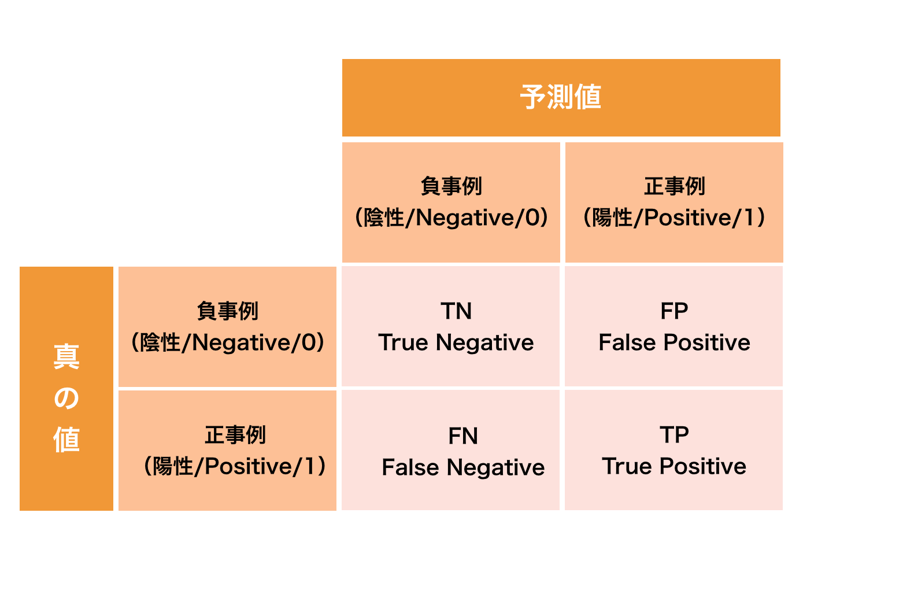

## Converting numbers

https://qiita.com/TTsurutani/items/c5d6aa37aa7451076f50  
Conversion between numerical types in Haskell must be done explicitly.

### Integers
- **Int**: Integers of 64 bits
- **Integer**: Integers(arbitrarily long)

Operations: +, -, *, div, mod, rem, ^  
Relational operators: <, >, <=, >=, ==, /=

### Reals
- **Float**: 32-bit floation-point reals
- **Double**: 64-bit floating-point reals

Operations: +, -, *, /, **  
Relational operators: <, >, <=, >=, ==, /=

Integer to Real conversion: **fromIntegral**  
```
fromIntegral :: (Num b, Integral a) => a -> b
```
Real to Integer conversion: **round, floor ceiling** 


example:
```
n :: Int
❌ sqrt n
⭕️ sqrt (fromIntegral n)
```
we need to explicitly convert n to a floating-point number!  
(Because sqrt only applies to floating point numbers. )


## accuraccy


## confusion matrix & precision & recall
↓ confusion matrix



  

## F1-score
a popular metric for evaluating the performance of a classification model.  
Definition: Harmonic mean of precision and recall for a more balanced summarization of model performance.


this is equal to:


##  a variety of averaged F1-score
### Macro average
→ the most straightforward way
The macro-averaged F1 score (or macro F1 score) is computed using the arithmetic mean (aka unweighted mean) of all the per-class F1 scores.


### Weighted average
The weighted-averaged F1 score is calculated by taking the mean of all per-class F1 scores while considering each class’s support.  
🌟 Support refers to the number of actual occurrences of the class in the dataset.  


### Micro average
Micro averaging computes a global average F1 score by counting the sums of the True Positives (TP), False Negatives (FN), and False Positives (FP). 


## Which Average should I choose?
In general, if you are working with an **imbalanced dataset** where all classes are equally important, using the **macro average** would be a good choice as it treats all classes equally.

If you have an **imbalanced dataset but want to assign greater contribution to classes with more examples in the dataset**, then the **weighted average** is preferred.


Suppose you have a **balanced dataset** and want an **easily understandable metric for overall performance** regardless of the class. In that case, you can go with accuracy, which is essentially our **micro F1 score**.