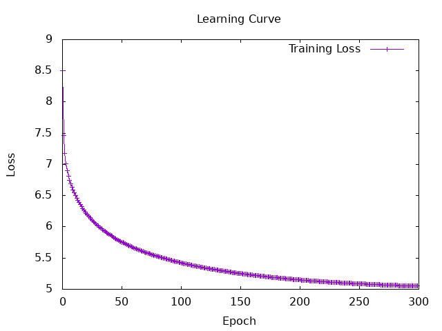

# Session6
### TODO
- [x] Watching the video of Bag of words 
- [x] Watching the video of  word2vec
- [ ] Build Bag of words 
- [x] Build word2vec
- [x] check my implementation
- [ ] Evaluate the trained model using STS
    - [ ] Prepare data
    - [ ] Evaluate the model (cosine similarity)   
- [x] Evaluate the model with two sentences and calculate similarity (without STS)

advanced  
- [ ] Calculating the meaning composition (word2vec)
- [x] Improve the model
- [ ] Make a survey on and implement “negative sampling”.
- [ ] Make a survey on “subword tokenization algorithms”

### What to do next
- [ ] Updating isUnncessaryChar
- [ ] **Build a model with full data**
- [ ] Implement evaluation with STS

## How to execute the code
```haskell
-- for training
docker-compose exec hasktorch /bin/bash -c "cd /home/ubuntu/Hasktorch && stack run session6-word2vec"

-- for training with mini-Batch
docker-compose exec hasktorch /bin/bash -c "cd /home/ubuntu/Hasktorch && stack run session6-word2vec-mini"

-- for evaluation
docker-compose exec hasktorch /bin/bash -c "cd /home/ubuntu/Hasktorch && stack run session6-word2vec-eval"
```

## Build word2vec
I build a model with smaller data (150columns) for checking my implementation. I will build more precise model with larger model later.


it takes a lot of time for training even with smaller data...  
**(About 20 seconds per one iteration)**

## Evaluate my implementation (without STS, pretty simple implementation...)

**① if the two sentences are the same, cosine similarity should be 1.** 
``` haskell
Sentence 1: Your first sentence here.
Sentence 2: Your first sentence here.
Vector representation of sentence 1: Tensor Float [9] [ 0.6801   , -4.8247e-2,  0.5427   ,  0.1331   ,  0.6641   ,  0.2208   , -0.2965   ,  0.5097   , -0.1879   ]
Vector representation of sentence 2: Tensor Float [9] [ 0.6801   , -4.8247e-2,  0.5427   ,  0.1331   ,  0.6641   ,  0.2208   , -0.2965   ,  0.5097   , -0.1879   ]
Cosine similarity between the two sentences: 1.0
```

**② Change only one word of the sentence (cosine similarity should be a little smaller than 1)**  
```haskell
Sentence 1: My first sentence here.
Sentence 2: Your first sentence here.
Vector representation of sentence 1: Tensor Float [9] [ 0.4495   ,  3.6553e-2,  0.7324   ,  0.3811   ,  0.3790   ,  0.9428   , -0.9673   ,  1.2678   ,  9.6277e-4]
Vector representation of sentence 2: Tensor Float [9] [ 0.6801   , -4.8247e-2,  0.5427   ,  0.1331   ,  0.6641   ,  0.2208   , -0.2965   ,  0.5097   , -0.1879   ]
Cosine similarity between the two sentences: 0.7906304
```

**③ Try with sentences whose score of STS is 1**  
```haskell
Sentence 1: You should do it.
Sentence 2: You can do it, too.
Vector representation of sentence 1: Tensor Float [9] [-0.9665   , -0.6121   , -0.3162   ,  2.0432   , -0.6591   ,  9.9336e-2,  0.7142   , -0.7231   , -1.2685   ]
Vector representation of sentence 2: Tensor Float [9] [-0.6462   , -0.5098   , -0.2024   ,  2.5507   , -0.1247   , -0.7358   ,  1.3034   , -0.6771   , -0.8282   ]
Cosine similarity between the two sentences: 0.90568423
```

**④ Try with sentences whose score of STS is 5**  
```haskell
Sentence 1: You can do it.
Sentence 2: You can do it, too.
Vector representation of sentence 1: Tensor Float [9] [-0.7063   , -0.4049   , -1.3095e-2,  2.6240   , -0.7863   , -0.6326   ,  1.1329   , -1.0934   , -0.6357   ]
Vector representation of sentence 2: Tensor Float [9] [-0.6462   , -0.5098   , -0.2024   ,  2.5507   , -0.1247   , -0.7358   ,  1.3034   , -0.6771   , -0.8282   ]
Cosine similarity between the two sentences: 0.96699435
```

**⑤ Try with longer sentences (score of STS is 2)**  
```haskell
Sentence 1: I am not sure this is the right site for the question.
Sentence 2: I am not sure this question would have made much sense to the Romans themselves.
Vector representation of sentence 1: Tensor Float [9] [ 0.1815   , -0.5414   ,  0.2092   ,  2.3660   ,  0.7186   ,  4.0874e-2,  0.5807   ,  0.4891   ,  8.5605e-3]
Vector representation of sentence 2: Tensor Float [9] [ 0.2838   , -0.5506   , -0.2668   ,  2.2505   ,  4.9591e-2, -0.2928   ,  0.5742   ,  0.1689   , -0.2026   ]
Cosine similarity between the two sentences: 0.9298487
```

🌟 Cosine similarity is pretty high in all cases   
→ This is because I built the model with smaller data, and if the word is not found in the wordlist, it set to 0 (the same index, vector)

**Need to try build model with larger data!!**

## Try to build a model with larger data
**🌟Loading review-texts.txt takes so much time (more than 10 hours?!)**   

**update: Tried with 2000 lines, and it took about a day!!**

### training
```
-- Hyperparameters
learningRate :: Float
learningRate = 0.5
numIters :: Int
numIters = 300
batchSize :: Int
batchSize = 50
```


### evaluation
**① if the two sentences are the same, cosine similarity should be 1.** 
``` haskell
Sentence 1: Your first sentence here.
Sentence 2: Your first sentence here.
Vector representation of sentence 1: Tensor Float [9] [ 0.1066   , -5.2857e-2,  0.5741   ,  2.2641   ,  0.8787   , -0.1858   ,  0.2418   ,  0.3828   ,  0.8683   ]
Vector representation of sentence 2: Tensor Float [9] [ 0.1066   , -5.2857e-2,  0.5741   ,  2.2641   ,  0.8787   , -0.1858   ,  0.2418   ,  0.3828   ,  0.8683   ]
Cosine similarity between the two sentences: 1.0
```

**② Change only one word of the sentence (cosine similarity should be a little smaller than 1)**  
```haskell
Sentence 1: My first sentence here.
Sentence 2: Your first sentence here.
Vector representation of sentence 1: Tensor Float [9] [-9.0407e-2,  0.4153   ,  6.2485e-2,  2.3163   ,  1.6397   , -0.1591   ,  0.9851   ,  0.1052   ,  0.3386   ]
Vector representation of sentence 2: Tensor Float [9] [ 0.1066   , -5.2857e-2,  0.5741   ,  2.2641   ,  0.8787   , -0.1858   ,  0.2418   ,  0.3828   ,  0.8683   ]
Cosine similarity between the two sentences: 0.8860327
```
0.7906304 → 0.8860327 (seems better)   

**③ Try with sentences whose score of STS is 1**     
```haskell
Sentence 1: You should do it
Sentence 2: You can do it, too
Vector representation of sentence 1: Tensor Float [9] [-1.0015   , -0.7386   ,  0.1223   ,  4.5560   , -0.2556   , -0.4472   , -0.4045   , -0.5726   , -0.1511   ]
Vector representation of sentence 2: Tensor Float [9] [-0.5036   ,  7.2754e-2,  0.7905   ,  4.3181   , -0.2638   , -0.3690   , -1.4724e-2, -0.4303   , -0.1340   ]
Cosine similarity between the two sentences: 0.9657118
```
0.90568423 → 0.9657118 (??)   

**④ Try with sentences whose score of STS is 5**     
```haskell
Sentence 1: You can do it
Sentence 2: You can do it, too
Vector representation of sentence 1: Tensor Float [9] [-1.0457   , -0.5252   ,  0.2616   ,  4.6087   , -0.4242   , -0.7662   , -0.3321   , -0.5490   , -6.4082e-2]
Vector representation of sentence 2: Tensor Float [9] [-0.5036   ,  7.2754e-2,  0.7905   ,  4.3181   , -0.2638   , -0.3690   , -1.4724e-2, -0.4303   , -0.1340   ]
Cosine similarity between the two sentences: 0.9738003
```
0.96699435 → 0.9738003 (seems better)   

**⑤ Try with longer sentences (score of STS is 2)**  
```haskell
Sentence 1: I am not sure this is the right site for the question.
Sentence 2: I am not sure this question would have made much sense to the Romans themselves.
Vector representation of sentence 1: Tensor Float [9] [-0.1159   ,  0.2990   , -0.2238   ,  3.8684   ,  0.8873   ,  0.1330   , -0.6098   ,  0.1255   ,  0.3811   ]
Vector representation of sentence 2: Tensor Float [9] [ 0.1357   ,  1.5973e-2,  0.1134   ,  3.6288   ,  0.4735   ,  0.1503   , -0.4644   , -0.3892   , -0.2204   ]
Cosine similarity between the two sentences: 0.96613985
```
0.9298487 → 0.96613985 (??)

## Try to build a model with mini-Batch

```haskell
learningRate :: Float
learningRate = 0.5
numIters :: Int
numIters = 300
batchSize :: Int
batchSize = 50
```
**It takes about 2 seconds per one iteration!!**
