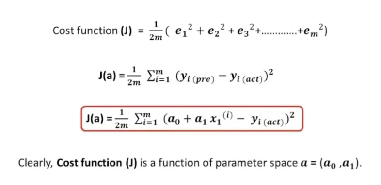
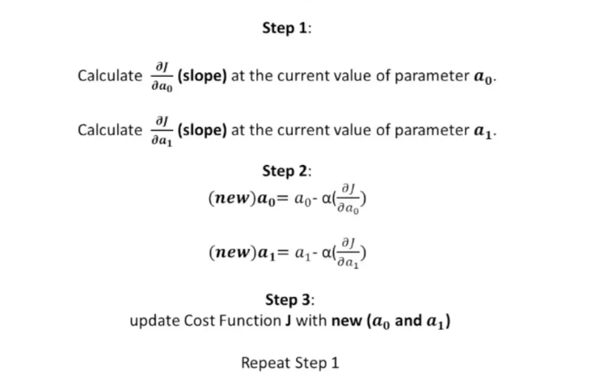

# Linear Regression

### modelとは？

→ インプットとアウトプットを表す数学的な関係性のこと  
→ describes the relationship between input(s) and output

### なぜモデルが必要？？

① インプットからアウトプットを予測することが可能だから

② 結果が未知のデータに対して予測できる

**一番シンプルなのがLinear Regression!**   

---

### Definition of regression
simple linear regression (単回帰)  
$$y= a_0+a_1x_1$$

multiple linear regression (重回帰)   
$$y= a_0+a_1x_1+ a_2x_2….$$

y: target (目的変数)

xn: feature (説明変数)

an: model parameters (regression coefficients? , 回帰係数)

**🌟 best fitとなるようにanの値を調整する! 🌟**

---
### Definition of best fit？？

**Error Term (e) : predicted - actual**

cost function → 損失関数・コスト関数

### How to minimize the Cost Function?

単にa0,a1…の関数と見ればいい！  
↓
**gradient descent algorhytm (勾配降下法)**

if α is...  
big → larger step, fast!!

small → smaller step, slow :(

**step = α*f’(a1)**

🌟ステップが大きいと最小に無限にたどり着けなくなってしまう&小さいと時間がかかりすぎてしまう🌟

**→ best way: set α to around 0.01**

α: hyper parameter
→a1,a2などには影響しないが、モデルのパフォーマンスに大きく影響する!